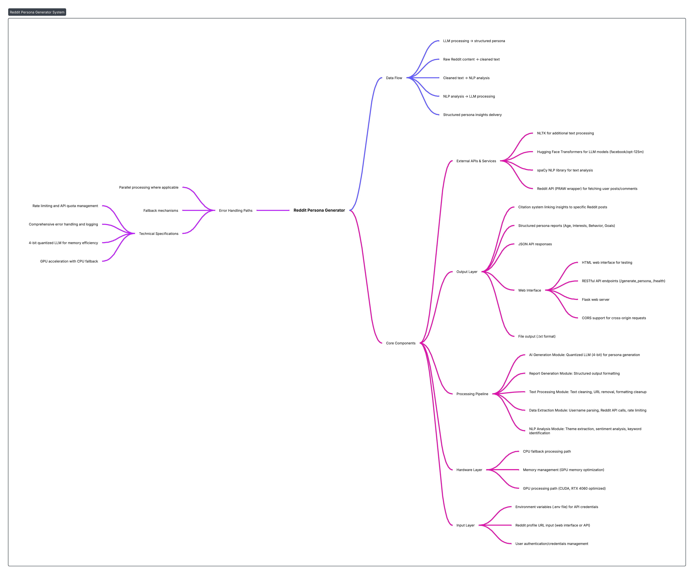

# Reddit Persona Generator v2.0

A professional, modular AI-powered system for generating comprehensive user personas from Reddit profiles using advanced NLP and quantized LLM technology.

<div align="center">


</div>

## 🚀 Key Features

- **🏗️ Professional Modular Architecture**: Clean separation of concerns with enterprise-ready design patterns
- **🤖 Advanced AI Pipeline**: Quantized LLM (facebook/opt-125m) with 4-bit quantization for efficient inference
- **🧠 Comprehensive NLP Analysis**: spaCy-powered text processing with sentiment analysis and entity extraction
- **🌐 Modern Web Interface**: Beautiful, responsive React-style interface with real-time updates
- **📡 RESTful API**: Clean REST endpoints with proper HTTP status codes and error handling
- **🔗 Reddit Integration**: Robust PRAW-based data fetching with rate limiting and error handling
- **📊 Structured Output**: Professional reports with citations, statistics, and structured data
- **⚙️ Configuration Management**: Environment-based configuration with validation
- **🛠️ Developer-Friendly**: Type hints, comprehensive logging, and extensive documentation

## 📦 Architecture Overview

### System Architecture Diagram

<div align="center">



</div>

### Project Structure

```
Reddit-persona/
├── app.py                    # 🚀 Main Flask application
├── config.py                 # ⚙️ Configuration management
├── persona_generator/        # 📦 Main package
│   ├── __init__.py          # Package exports
│   ├── core.py              # 🎯 PersonaGenerator orchestrator
│   ├── reddit_client.py     # 🔗 Reddit API interactions
│   ├── nlp_processor.py     # 🧠 NLP processing & analysis
│   ├── llm_handler.py       # 🤖 LLM model management
│   ├── persona_builder.py   # 🏗️ Persona construction logic
│   └── utils.py             # 🛠️ Utility functions
├── example_usage.py         # 📝 Usage examples
└── output/                  # 📁 Generated reports
```

### Component Responsibilities

| Component | Purpose | Key Features |
|-----------|---------|--------------|
| **PersonaGenerator** | Main orchestrator | Coordinates all components, manages lifecycle |
| **RedditClient** | Reddit API management | Rate limiting, error handling, data fetching |
| **NLPProcessor** | Text analysis | spaCy processing, sentiment analysis, entity extraction |
| **LLMHandler** | Model management | Quantized model loading, GPU optimization, text generation |
| **PersonaBuilder** | Persona construction | Structured persona building with citations |

## 🛠️ Installation

### Prerequisites
- Python 3.8+
- NVIDIA GPU with 4GB+ VRAM (recommended)
- CUDA toolkit (for GPU acceleration)

### Quick Start
```bash
# Clone the repository
git clone <repository-url>
cd Reddit-persona

# Install dependencies
pip install -r requirements.txt

# Download spaCy model
python -m spacy download en_core_web_sm

# Set up environment variables
cp .env.example .env
# Edit .env with your Reddit API credentials
```

### Environment Configuration
Create a `.env` file with your Reddit API credentials:
```env
REDDIT_CLIENT_ID=your_reddit_client_id_here
REDDIT_CLIENT_SECRET=your_reddit_client_secret_here
REDDIT_USER_AGENT=PersonaGenerator/2.0
```

## 🚀 Usage

### Option 1: Web Application (Recommended)
```bash
python app.py
```
Navigate to `http://localhost:5000` for the beautiful web interface.

### Option 2: Programmatic Usage
```python
from persona_generator import PersonaGenerator

# Initialize with automatic configuration
generator = PersonaGenerator()

# Generate persona from URL
result = generator.generate_persona_from_url(
    "https://www.reddit.com/user/kojied/",
    output_file="kojied_persona.txt"
)

# Access structured data
if 'error' not in result:
    persona = result['persona']
    print(f"Generated persona for {result['username']}")
    print(f"Demographics: {persona['demographics']}")
    print(f"Personality: {persona['personality']}")
```

### Option 3: Custom Configuration
```python
from persona_generator import PersonaGenerator

# Initialize with custom settings
generator = PersonaGenerator(
    reddit_client_id="your_id",
    reddit_client_secret="your_secret",
    model_name="facebook/opt-125m"
)

# Generate persona from user data
user_data = generator.reddit_client.fetch_user_data("username")
result = generator.generate_persona_from_data(user_data)
```

## 🌐 API Endpoints

### Generate Persona
```http
POST /generate_persona
Content-Type: application/json

{
    "profile_url": "https://www.reddit.com/user/kojied/"
}
```

**Response:**
```json
{
    "username": "kojied",
    "persona": {
        "demographics": {
            "age": "22-30",
            "occupation": "Software Developer",
            "status": "Single",
            "location": "Urban US",
            "tier": "Early Adopter",
            "archetype": "The Explorer"
        },
        "motivations": {
            "convenience": 7,
            "wellness": 5,
            "speed": 8,
            "social": 6,
            "achievement": 9,
            "learning": 8
        },
        "personality": {
            "extraversion": 6,
            "sensing": 4,
            "thinking": 8,
            "judging": 7
        },
        "behavior": {
            "items": [
                "Checks Reddit multiple times daily",
                "Prefers technical discussions",
                "Shares knowledge actively"
            ]
        },
        "frustrations": {
            "items": [
                "Debugging complex issues",
                "Inefficient processes",
                "Poor documentation"
            ]
        },
        "goals": {
            "items": [
                "Master new technologies",
                "Build efficient solutions",
                "Contribute to open source"
            ]
        },
        "quote": "Code quality matters more than quick fixes"
    },
    "output_file": "output/persona_kojied_20240115_143025.txt",
    "user_stats": {
        "posts": 45,
        "comments": 320,
        "comment_karma": 15420,
        "link_karma": 8750
    }
}
```

### Health Check
```http
GET /health
```

### System Information
```http
GET /api/info
```

## 📊 Output Format

The system generates comprehensive persona reports with:

### Demographics
- **Age Range**: Inferred from language patterns and life stage indicators
- **Occupation**: Based on subreddit participation and content topics
- **Status**: Relationship indicators from content analysis
- **Location**: Geographic hints from community participation
- **Tech Tier**: Technology adoption level assessment
- **Archetype**: Primary personality type classification

### Motivations (1-10 scale)
- **Convenience**: Preference for efficiency and automation
- **Wellness**: Health and self-care focus
- **Speed**: Preference for quick results
- **Social**: Community and relationship orientation
- **Achievement**: Goal-oriented behavior
- **Learning**: Knowledge acquisition drive

### Personality (1-10 scale)
- **Extraversion**: Social engagement level
- **Sensing**: Practical vs. theoretical preference
- **Thinking**: Logic vs. emotion in decisions
- **Judging**: Structure vs. flexibility preference

### Behavioral Patterns
- Specific observable behaviors from Reddit activity
- Posting patterns and timing analysis
- Interaction style and engagement preferences

### Frustrations & Goals
- Evidence-based frustrations from content analysis
- Specific goals derived from user discussions
- Contextual needs assessment

## 🔧 Configuration

The system uses a centralized configuration system:

```python
# config.py
class Config:
    # Reddit API settings
    REDDIT_CLIENT_ID = os.getenv('REDDIT_CLIENT_ID')
    REDDIT_CLIENT_SECRET = os.getenv('REDDIT_CLIENT_SECRET')
    
    # LLM settings
    DEFAULT_MODEL_NAME = "facebook/opt-125m"
    MAX_RESPONSE_LENGTH = 200
    
    # NLP settings
    SPACY_MODEL = "en_core_web_sm"
    MAX_POSTS_TO_ANALYZE = 50
    MAX_COMMENTS_TO_ANALYZE = 100
    
    # Quantization settings
    QUANTIZATION_CONFIG = {
        "load_in_4bit": True,
        "bnb_4bit_compute_dtype": "float16",
        "bnb_4bit_quant_type": "nf4",
        "bnb_4bit_use_double_quant": True,
    }
```

## 🧪 Testing & Examples

### Run Examples
```bash
python example_usage.py
```

### Test Cases Include
- Basic persona generation
- Batch user analysis
- Custom analysis workflows
- Error handling scenarios
- Performance benchmarking

## 🚀 Professional Highlights

### Enterprise-Ready Features
- ✅ **Modular Architecture**: Clean separation of concerns
- ✅ **Type Safety**: Comprehensive type hints throughout
- ✅ **Error Handling**: Robust error management and logging
- ✅ **Configuration Management**: Environment-based config
- ✅ **Resource Management**: Proper cleanup and context managers
- ✅ **API Design**: RESTful endpoints with proper HTTP codes
- ✅ **Documentation**: Comprehensive docstrings and examples

### Performance Optimizations
- **GPU Acceleration**: Automatic CUDA detection and optimization
- **Model Quantization**: 4-bit quantization for efficient inference
- **Caching**: Intelligent caching of model components
- **Batch Processing**: Efficient batch analysis capabilities
- **Memory Management**: Proper GPU memory cleanup

### Security & Privacy
- **Input Validation**: Comprehensive URL and data validation
- **Rate Limiting**: Respect for Reddit API limits
- **Error Sanitization**: Safe error messages without data leakage
- **Environment Variables**: Secure credential management

## 📋 Requirements

### Core Dependencies
```
torch>=1.9.0
transformers>=4.20.0
bitsandbytes>=0.35.0
accelerate>=0.13.0
praw>=7.0.0
spacy>=3.4.0
nltk>=3.7.0
textblob>=0.17.1
flask>=2.0.0
flask-cors>=3.0.0
python-dotenv>=0.19.0
```

### Hardware Requirements
- **GPU**: NVIDIA GPU with 4GB+ VRAM (recommended)
- **RAM**: 8GB+ system RAM
- **Storage**: 3GB+ free space for models
- **CUDA**: Compatible CUDA installation

## 🤝 Contributing

We welcome contributions! Please follow these steps:

1. **Fork** the repository
2. **Create** a feature branch (`git checkout -b feature/amazing-feature`)
3. **Commit** your changes (`git commit -m 'Add amazing feature'`)
4. **Push** to the branch (`git push origin feature/amazing-feature`)
5. **Open** a Pull Request

### Development Setup
```bash
# Install development dependencies
pip install -r requirements-dev.txt

# Run tests
python -m pytest tests/

# Run linting
flake8 persona_generator/
black persona_generator/
```

## 📝 License

This project is licensed under the MIT License - see the [LICENSE](LICENSE) file for details.

## ⚠️ Disclaimer

This tool is designed for educational and research purposes. Always respect user privacy and Reddit's terms of service. The generated personas are AI interpretations and should not be considered definitive or used for discriminatory purposes.

## 🙏 Acknowledgments

- **Reddit API**: For providing access to user data
- **Hugging Face**: For transformer models and quantization tools
- **spaCy**: For excellent NLP processing capabilities
- **Flask**: For the web framework
- **PyTorch**: For deep learning infrastructure

---

<div align="center">
<b>Built with ❤️ for the AI and NLP community</b>
</div> 